# ARCHITECTURE.md — System Architecture & Design

Generated 2026-03-01.

---

## Table of Contents

1. [System Architecture Diagram](#1-system-architecture-diagram)
2. [Page Map](#2-page-map)
3. [Data Flow Diagrams](#3-data-flow-diagrams)
4. [Component Tree](#4-component-tree)
5. [Wireframes](#5-wireframes)

---

## 1. System Architecture Diagram

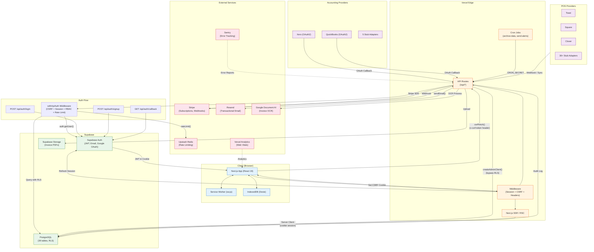

### Auth Flow Detail

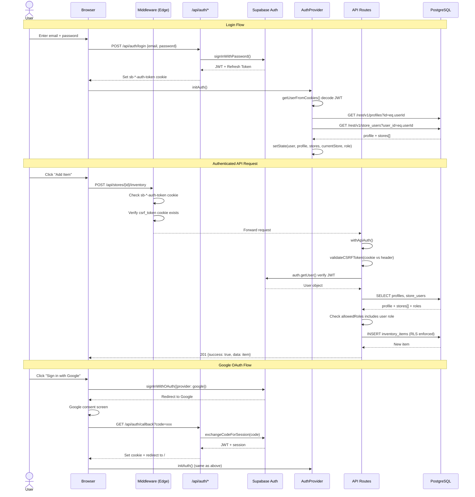

---

## 2. Page Map

```mermaid
flowchart TB
    subgraph Public["Public Pages (No Auth)"]
        HOME["/ <br/> Landing Page"]
        LOGIN["/login <br/> Sign In / Sign Up"]
        FORGOT["/forgot-password <br/> Password Reset"]
        RESETPW["/reset-password <br/> Set New Password"]
        ACCEPT["/accept-invite <br/> Accept Invite"]
        ONBOARD_PUB["/onboard <br/> Initial Onboarding"]
        PRICING["/pricing <br/> Pricing Page"]
        PRIVACY["/privacy <br/> Privacy Policy"]
        TERMS["/terms <br/> Terms of Service"]
        COOKIES["/cookies <br/> Cookie Policy"]
        OFFLINE["/offline <br/> Offline Fallback"]
    end

    subgraph SupplierPortal["Supplier Portal (Token Auth)"]
        PORTAL["/portal <br/> Portal Home"]
        P_ORDERS["/portal/orders <br/> PO List"]
        P_ORDER_D["/portal/orders/poId <br/> PO Detail"]
        P_CATALOG["/portal/catalog <br/> Catalog"]
        P_INVOICES["/portal/invoices <br/> Invoices"]
    end

    subgraph Onboarding["Onboarding (Auth Required)"]
        OB["/onboarding <br/> Store Setup Wizard"]
    end

    subgraph Dashboard["Dashboard (Auth Required)"]
        DASH["/ <br/> Dashboard <br/> O M S"]

        subgraph Stock["Stock Management"]
            INV["/inventory <br/> Inventory List <br/> O M S"]
            INV_VAL["/inventory-value <br/> Stock Costs <br/> O M"]
            DELIVERIES["/deliveries <br/> Stock Reception <br/> O M S"]
            STOCK_CT["/stock-count <br/> Stock Count <br/> O M S"]
            LOW_STOCK["/low-stock <br/> Low Stock Items <br/> O M"]
        end

        subgraph Operations["Operations"]
            RECIPES["/recipes <br/> Menu and Costs <br/> O M"]
            SUPPLIERS["/suppliers <br/> Suppliers and POs <br/> O M"]
            INVOICES["/invoices <br/> Invoices <br/> O M"]
            WASTE["/waste <br/> Waste Tracking <br/> O M S"]
            HACCP["/haccp <br/> Food Safety <br/> O M S"]
            HACCP_CK["/haccp/checks <br/> Daily Checks <br/> O M S"]
            HACCP_TMP["/haccp/templates <br/> Templates <br/> O M"]
            HACCP_TEMP["/haccp/temperatures <br/> Temp Logs <br/> O M S"]
            HACCP_CA["/haccp/corrective-actions <br/> Corrective Actions <br/> O M"]
        end

        subgraph Team["Team Management"]
            USERS["/users <br/> Team Members <br/> O M"]
            SHIFTS["/shifts <br/> Shift Schedule <br/> O M"]
            TIMETABLE["/shifts/timetable <br/> Weekly Timetable <br/> O M"]
            MY_SHIFTS["/my-shifts <br/> My Shifts <br/> S"]
            PAYROLL["/payroll <br/> Payroll <br/> O M"]
            MY_PAY["/my-pay <br/> My Pay <br/> S"]
        end

        subgraph Insights["Insights"]
            REPORTS["/reports <br/> Reports Hub <br/> O M"]
            RPT_FC["/reports/food-cost <br/> Food Cost <br/> O M"]
            RPT_FORE["/reports/forecast <br/> AI Forecast <br/> O M"]
            RPT_BENCH["/reports/benchmark <br/> Benchmarking <br/> O M"]
            RPT_DAILY["/reports/daily-summary <br/> Daily Summary <br/> O M"]
            RPT_LOW["/reports/low-stock <br/> Low Stock Report <br/> O M"]
            ACTIVITY["/activity <br/> Activity Log <br/> O M"]
        end

        subgraph System["System"]
            INTEG["/integrations <br/> Integration Hub <br/> O"]
            INTEG_XE["/integrations/xero <br/> Xero Setup <br/> O"]
            INTEG_QB["/integrations/quickbooks <br/> QuickBooks Setup <br/> O"]
            INTEG_AC["/integrations/accounting <br/> Accounting <br/> O"]
            SETTINGS["/settings <br/> Store Settings <br/> O M"]
            BILLING["/billing <br/> Billing <br/> O"]
            BILLING_SUB["/billing/subscribe/storeId <br/> Checkout <br/> O"]
            PROFILE["/profile <br/> My Profile <br/> O M S"]
            CATEGORIES["/categories <br/> Categories <br/> O M"]
            TAGS["/tags <br/> Tags <br/> O M"]
        end

        subgraph StoreScoped["Store-Scoped Pages"]
            S_USERS["/stores/storeId/users <br/> Store Users <br/> O M"]
            S_CATS["/stores/storeId/categories <br/> Store Categories <br/> O M"]
            S_TAGS["/stores/storeId/tags <br/> Store Tags <br/> O M"]
            S_POS["/stores/storeId/pos <br/> POS Connection <br/> O"]
            S_STOCK["/stores/storeId/stock <br/> Store Stock <br/> O M S"]
            S_RECV["/stores/storeId/stock-reception <br/> Store Reception <br/> O M S"]
            S_EXPIRED["/stores/storeId/subscription-expired <br/> Expired Warning <br/> O"]
            STORES_NEW["/stores/new <br/> Create Store <br/> O M S"]
        end
    end

    HOME -->|"Sign In"| LOGIN
    HOME -->|"Sign Up"| LOGIN
    HOME -->|"Pricing"| PRICING
    HOME -->|"Privacy"| PRIVACY
    HOME -->|"Terms"| TERMS
    HOME -->|"Cookies"| COOKIES
    LOGIN -->|"Forgot?"| FORGOT
    FORGOT -->|"Email link"| RESETPW
    LOGIN -->|"Success"| DASH
    ACCEPT -->|"Set password"| ONBOARD_PUB
    ONBOARD_PUB -->|"Create store"| OB
    OB -->|"Complete"| DASH

    DASH --> INV
    DASH --> DELIVERIES
    DASH --> STOCK_CT
    DASH --> LOW_STOCK
    DASH --> INV_VAL

    DASH --> RECIPES
    DASH --> SUPPLIERS
    DASH --> INVOICES
    DASH --> WASTE
    DASH --> HACCP
    HACCP --> HACCP_CK
    HACCP --> HACCP_TMP
    HACCP --> HACCP_TEMP
    HACCP --> HACCP_CA

    DASH --> USERS
    DASH --> SHIFTS
    SHIFTS --> TIMETABLE
    DASH --> MY_SHIFTS
    DASH --> PAYROLL
    DASH --> MY_PAY

    DASH --> REPORTS
    REPORTS --> RPT_FC
    REPORTS --> RPT_FORE
    REPORTS --> RPT_BENCH
    REPORTS --> RPT_DAILY
    REPORTS --> RPT_LOW
    DASH --> ACTIVITY

    DASH --> INTEG
    INTEG --> INTEG_XE
    INTEG --> INTEG_QB
    INTEG --> INTEG_AC
    DASH --> SETTINGS
    DASH --> BILLING
    BILLING --> BILLING_SUB
    DASH --> PROFILE
    DASH --> CATEGORIES
    DASH --> TAGS

    PORTAL --> P_ORDERS
    P_ORDERS --> P_ORDER_D
    PORTAL --> P_CATALOG
    PORTAL --> P_INVOICES
```

**Role legend:** O = Owner, M = Manager, S = Staff. Sidebar navigation filters links by role.

---

## 3. Data Flow Diagrams

### 3.1 Creating an Inventory Item

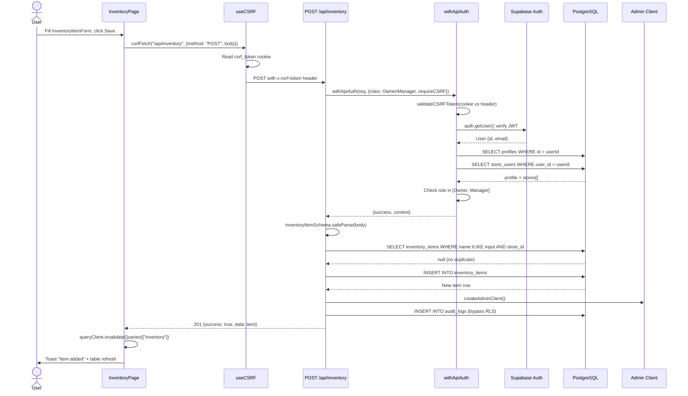

### 3.2 Processing a POS Sale (Webhook)

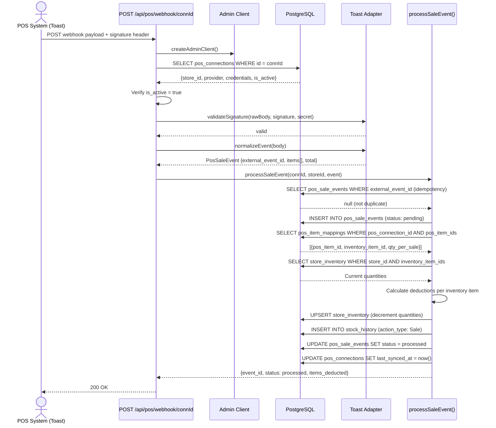

### 3.3 Adding a Staff Member (Invite)

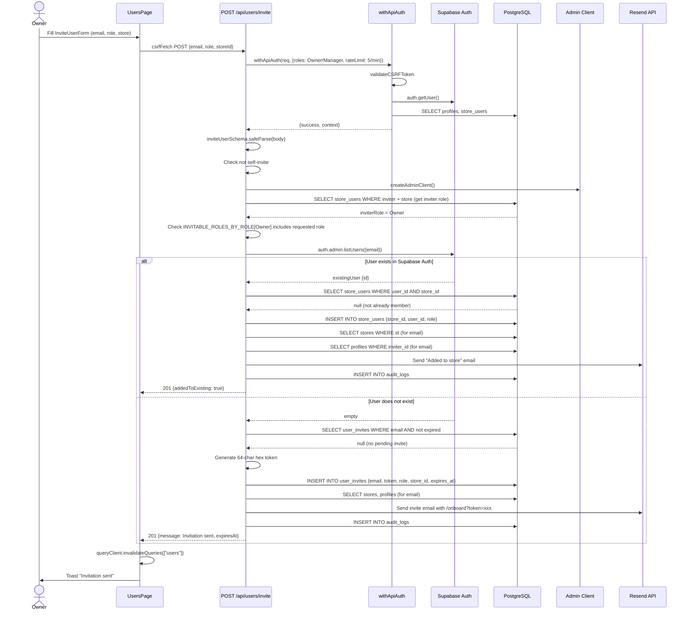

### 3.4 Running Payroll (Create Pay Run)

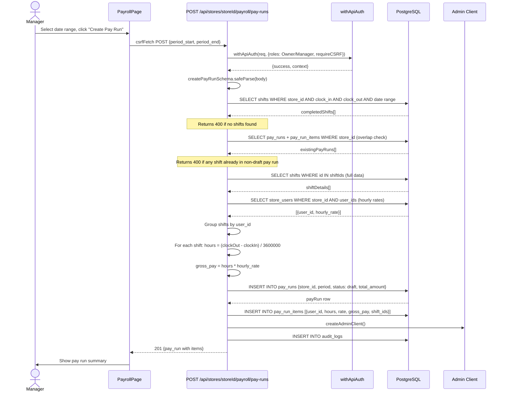

### 3.5 Submitting a Stock Count

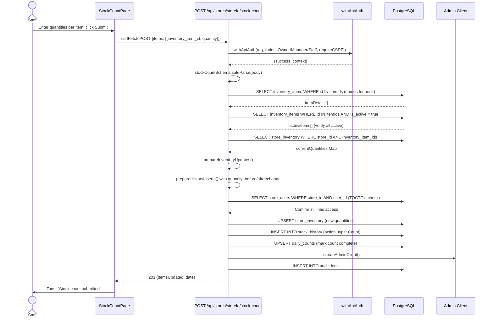

### 3.6 HACCP Check Submission

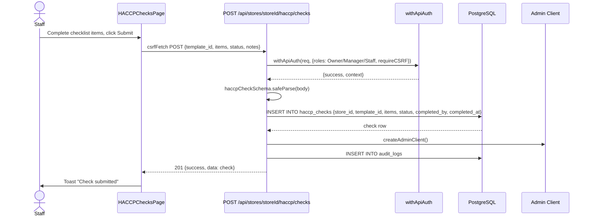

### 3.7 Purchase Order Create and Receive

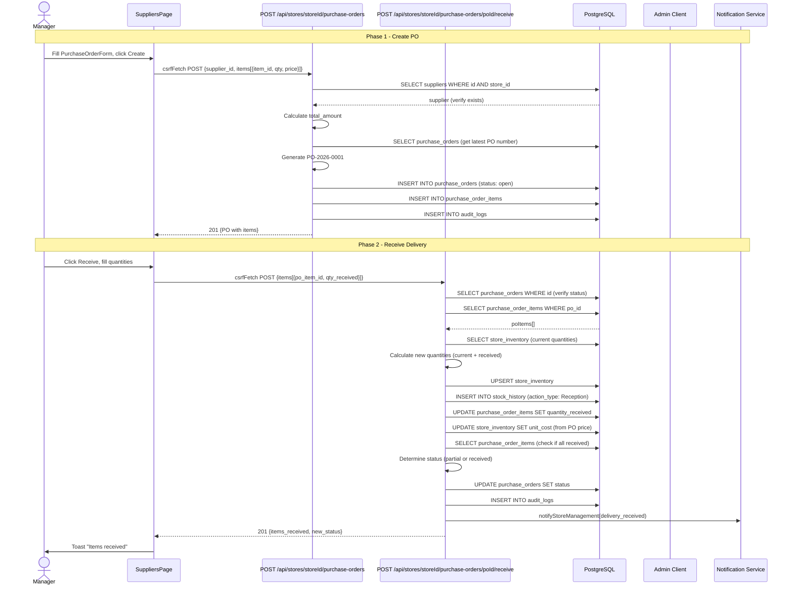

---

## 4. Component Tree

### 4.1 Provider & Layout Hierarchy

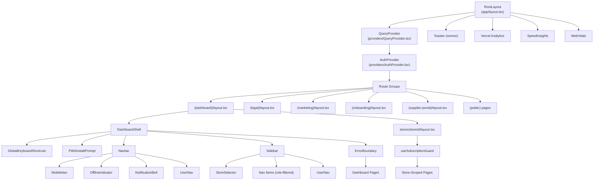

### 4.2 Dashboard Home Components

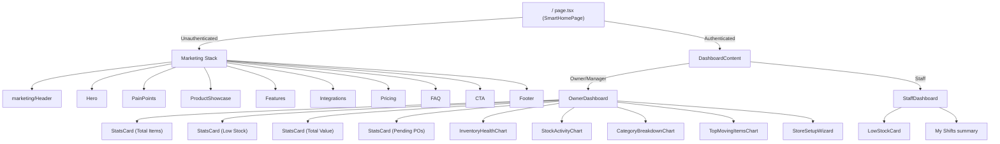

### 4.3 Inventory Page Components

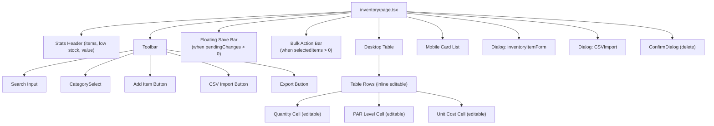

### 4.4 Suppliers Page Components

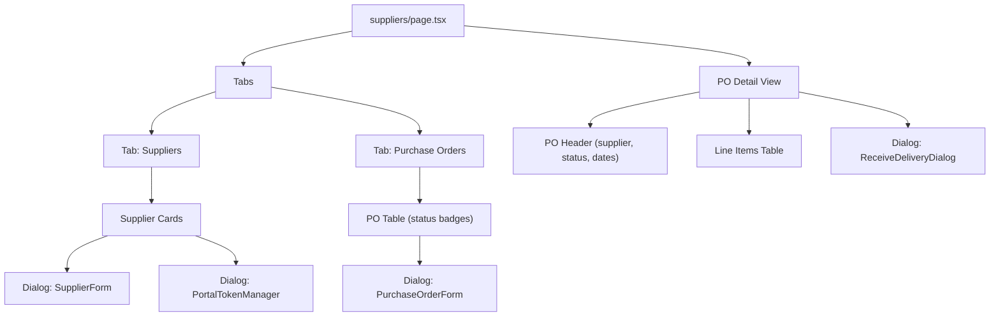

### 4.5 Shifts Page Components

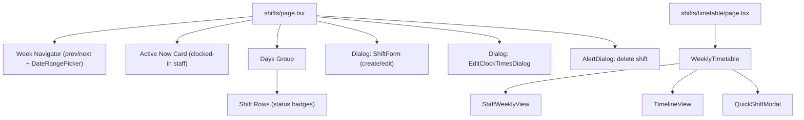

### 4.6 HACCP Pages Components

```mermaid
graph TD
    HD["haccp/page.tsx (Dashboard)"]
    HD --> HS1["StatsCard (Compliance Score)"]
    HD --> HS2["StatsCard (Checks Today)"]
    HD --> HS3["StatsCard (Temp Alerts)"]
    HD --> HS4["StatsCard (Open Actions)"]
    HD --> DUE["Due Checks Reminders"]
    HD --> RCT["Recent Checks Table"]
    HD --> TAT["Temp Alerts Table"]
    HD --> NAV_CARDS["Navigation Cards"]

    HC["haccp/checks/page.tsx"]
    HC --> CL["Check List + Status"]
    HC --> CF["Check Form (from template)"]

    HT["haccp/templates/page.tsx"]
    HT --> TL["Template List"]
    HT --> TF["Template Form"]

    HTEMP["haccp/temperatures/page.tsx"]
    HTEMP --> TEMPL["Temperature Log List"]
    HTEMP --> TEMPF["Temperature Entry Form"]

    HCA["haccp/corrective-actions/page.tsx"]
    HCA --> CAL["Corrective Actions List"]
    HCA --> CAF["Corrective Action Form"]
```

### 4.7 Reports Page Components

```mermaid
graph TD
    RP["reports/page.tsx (Hub - Server Component)"]
    RP --> RC1["Link Card: AI Forecast"]
    RP --> RC2["Link Card: Food Cost"]
    RP --> RC3["Link Card: Benchmarking"]
    RP --> RC4["Link Card: Daily Summary"]
    RP --> RC5["Link Card: Low Stock"]

    FORE["reports/forecast/page.tsx"]
    FORE --> EXEC["Executive Summary"]
    FORE --> URG["Urgent Orders"]
    FORE --> DETAIL["Item Detail Drill-down"]
    FORE --> FC_CHART["ForecastChart"]
    FORE --> WDPC["Weekday Pattern Chart"]

    FCOST["reports/food-cost/page.tsx"]
    FCOST --> THEO["Theoretical Cost"]
    FCOST --> ACT["Actual COGS"]
    FCOST --> VAR["Variance Analysis"]
    FCOST --> CATB["Category Breakdown"]

    BENCH["reports/benchmark/page.tsx"]
    BENCH --> SCC["StoreComparisonChart"]
    BENCH --> RANK["Rankings Table"]
    BENCH --> HEALTH["Health Scores"]
```

### 4.8 Billing Page Components

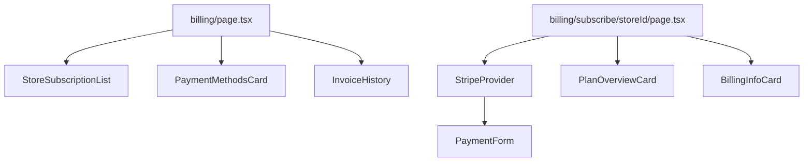

### 4.9 Users & Team Components

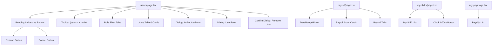

### 4.10 Auth Pages Components

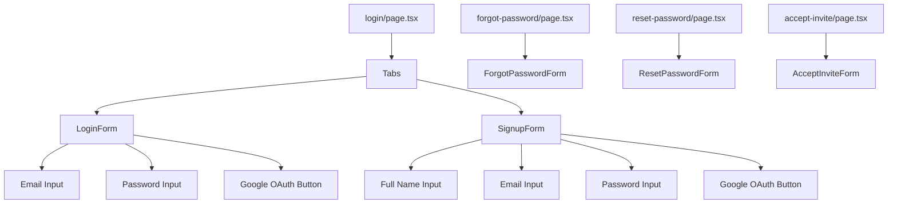

---

## 5. Wireframes

### 5.1 Dashboard Shell (All Dashboard Pages)

```
+---------------------------------------------------------------+
| [Navbar]                                                       |
| +--+------+-------------------+------+------+------+--------+ |
| |  | Qaos |                   | Wifi | Bell | Avatar ▾      | |
| |☰ |      |                   | Ind. | Notif| UserNav       | |
| +--+------+-------------------+------+------+------+--------+ |
+---------------------------------------------------------------+
|          |                                                     |
| [Sidebar]|  [Main Content Area]                                |
| w=224px  |  <ErrorBoundary>                                    |
|          |                                                     |
| Qaos     |    {page content}                                   |
|          |                                                     |
| [Store   |                                                     |
|  Selector|                                                     |
|  ▾     ] |                                                     |
|          |                                                     |
| ─────── |                                                     |
| Overview |                                                     |
|  Dashboard|                                                    |
| ─────── |                                                     |
| Stock    |                                                     |
|  Inventory|                                                    |
|  Deliveries                                                    |
|  Stock Costs                                                   |
|  Stock Count                                                   |
|  Low Stock|                                                    |
| ─────── |                                                     |
| Operations                                                     |
|  Menu&Cost|                                                    |
|  Suppliers|                                                    |
|  Invoices |                                                    |
|  Waste    |                                                    |
|  Food Safe|                                                    |
| ─────── |                                                     |
| Team     |                                                     |
|  Team     |                                                    |
|  Shifts   |                                                    |
|  Payroll  |                                                    |
| ─────── |                                                     |
| Insights |                                                     |
|  Reports  |                                                    |
|  Activity |                                                    |
| ─────── |                                                     |
| System   |                                                     |
|  Integr.  |                                                    |
|  Settings |                                                    |
|  Billing  |                                                    |
| ─────── |                                                     |
| [UserNav]|                                                     |
+----------+-----------------------------------------------------+
```

### 5.2 Home / Dashboard (Owner View)

```
+---------------------------------------------------------------+
| [Navbar]                                                       |
+----------+-----------------------------------------------------+
| [Sidebar]|                                                     |
|          |  Welcome back, {name}                               |
|          |                                                     |
|          |  +------------+ +------------+ +----------+ +-----+ |
|          |  | StatsCard  | | StatsCard  | | StatsCard| |Stats| |
|          |  | Total Items| | Low Stock  | | Total Val| |Pend.| |
|          |  | 247        | | 12 ⚠       | | £14,320 | |POs 3| |
|          |  +------------+ +------------+ +----------+ +-----+ |
|          |                                                     |
|          |  [StoreSetupWizard — if store not complete]         |
|          |  +-----------------------------------------------+ |
|          |  | Setup: ✓ Inventory  ✓ Shifts  ○ Suppliers     | |
|          |  +-----------------------------------------------+ |
|          |                                                     |
|          |  +---------------------+ +----------------------+ |
|          |  | InventoryHealthChart| | StockActivityChart   | |
|          |  | [Donut chart]       | | [Bar chart]          | |
|          |  |  ● In stock: 200    | | Mon Tue Wed Thu Fri  | |
|          |  |  ● Low: 35          | | ███ ██  ███ ██  ███  | |
|          |  |  ● Critical: 12     | |                      | |
|          |  +---------------------+ +----------------------+ |
|          |                                                     |
|          |  +---------------------+ +----------------------+ |
|          |  | CategoryBreakdown   | | TopMovingItemsChart  | |
|          |  | [Pie chart]         | | 1. Tomatoes   ████   | |
|          |  |                     | | 2. Chicken    ███    | |
|          |  |                     | | 3. Flour      ██     | |
|          |  +---------------------+ +----------------------+ |
+----------+-----------------------------------------------------+
```

### 5.3 Inventory Page

```
+---------------------------------------------------------------+
| [Navbar]                                                       |
+----------+-----------------------------------------------------+
| [Sidebar]|                                                     |
|          |  Inventory                                          |
|          |                                                     |
|          |  +----------+ +----------+ +----------+            |
|          |  | 247      | | 12       | | £14,320  |            |
|          |  | Items    | | Low Stock| | Value    |            |
|          |  +----------+ +----------+ +----------+            |
|          |                                                     |
|          |  [Toolbar]                                          |
|          |  +-------------------+ +----------+ +--+ +--+ +--+|
|          |  | 🔍 Search items..| |Category ▾| |+Add| |CSV| |↓| |
|          |  +-------------------+ +----------+ +----+ +---+ +-+|
|          |                                                     |
|          |  [Floating Save Bar — when changes pending]        |
|          |  +-----------------------------------------------+ |
|          |  | 3 unsaved changes        [Discard] [Save All] | |
|          |  +-----------------------------------------------+ |
|          |                                                     |
|          |  [InventoryTable — Desktop]                        |
|          |  +---+--------+------+-----+------+-------+------+|
|          |  | ☐ | Name   | Unit | Qty | PAR  | Cost  | ...  ||
|          |  +---+--------+------+-----+------+-------+------+|
|          |  | ☐ | Tomato | kg   | [8] | [20] | [2.50]| Edit ||
|          |  | ☐ | Chicken| kg   | [3] | [15] | [7.80]| Edit ||
|          |  | ☐ | Flour  | kg   |[25] | [30] | [0.95]| Edit ||
|          |  +---+--------+------+-----+------+-------+------+|
|          |  | < 1 2 3 ... 5 >  50/page                       |
|          |                                                     |
|          |  [Dialog: InventoryItemForm]                       |
|          |  +-----------------------------------------------+ |
|          |  | Add Inventory Item                     [X]    | |
|          |  | Name:     [________________]                  | |
|          |  | Unit:     [kg ▾]                              | |
|          |  | Category: [Produce ▾]                         | |
|          |  | PAR Level:[___]  Cost: [___]                  | |
|          |  |                          [Cancel] [Save]      | |
|          |  +-----------------------------------------------+ |
+----------+-----------------------------------------------------+
```

### 5.4 Stock Count Page

```
+---------------------------------------------------------------+
| [Navbar]                                                       |
+----------+-----------------------------------------------------+
| [Sidebar]|                                                     |
|          |  Stock Count                                        |
|          |                                                     |
|          |  [Status Banner]                                    |
|          |  +-----------------------------------------------+ |
|          |  | ✓ Today's count: Complete (submitted 2:30 PM) | |
|          |  +-----------------------------------------------+ |
|          |  — or —                                             |
|          |  +-----------------------------------------------+ |
|          |  | ⚠ Today's count: Pending                      | |
|          |  +-----------------------------------------------+ |
|          |                                                     |
|          |  [StockCountForm]                                  |
|          |  +-----------------------------------------------+ |
|          |  | 🔍 Search or scan barcode...  [📷 Scan]       | |
|          |  +-----------------------------------------------+ |
|          |  | Item              | Current | New Qty          | |
|          |  +-----------------+---------+------------------+ |
|          |  | Tomatoes (kg)   | 8.00    | [________]       | |
|          |  | Chicken (kg)    | 3.00    | [________]       | |
|          |  | Flour (kg)      | 25.00   | [________]       | |
|          |  | Olive Oil (L)   | 4.50    | [________]       | |
|          |  | Mozzarella (kg) | 6.00    | [________]       | |
|          |  +-----------------+---------+------------------+ |
|          |  |                                               | |
|          |  | Notes: [______________________________]       | |
|          |  |                                               | |
|          |  |                         [Submit Count]        | |
|          |  +-----------------------------------------------+ |
+----------+-----------------------------------------------------+
```

### 5.5 Deliveries / Stock Reception Page

```
+---------------------------------------------------------------+
| [Navbar]                                                       |
+----------+-----------------------------------------------------+
| [Sidebar]|                                                     |
|          |  Stock Reception                                    |
|          |                                                     |
|          |  +----------+ +----------+ +----------+            |
|          |  | 3        | | 47       | | 1,204    |            |
|          |  | Today    | | Items    | | All Time |            |
|          |  | Delivries| | Received | | Delivries|            |
|          |  +----------+ +----------+ +----------+            |
|          |                                                     |
|          |  [StockReceptionForm]                              |
|          |  +-----------------------------------------------+ |
|          |  | Supplier: [Select supplier ▾]                 | |
|          |  | PO Ref:   [Select PO ▾] (optional)            | |
|          |  +-----------------------------------------------+ |
|          |  | Item              | Expected | Received        | |
|          |  +-----------------+----------+-----------------+ |
|          |  | Tomatoes (kg)   | 50       | [________]      | |
|          |  | Chicken (kg)    | 30       | [________]      | |
|          |  +-----------------+----------+-----------------+ |
|          |  | Notes: [______________________________]       | |
|          |  |                      [Record Delivery]        | |
|          |  +-----------------------------------------------+ |
|          |                                                     |
|          |  Recent Deliveries                                 |
|          |  +-----------------------------------------------+ |
|          |  | Today 2:30 PM  | Fresh Foods Ltd | 5 items    | |
|          |  | Today 9:15 AM  | Dairy Direct    | 3 items    | |
|          |  | Yesterday      | Meat Suppliers  | 8 items    | |
|          |  +-----------------------------------------------+ |
+----------+-----------------------------------------------------+
```

### 5.6 Suppliers Page (List View)

```
+---------------------------------------------------------------+
| [Navbar]                                                       |
+----------+-----------------------------------------------------+
| [Sidebar]|                                                     |
|          |  Suppliers                                          |
|          |                                                     |
|          |  [Tabs]                                             |
|          |  [ Suppliers ] [ Purchase Orders ]                  |
|          |  ═══════════                                        |
|          |                                                     |
|          |  +--+ +-------------------------------------------+|
|          |  |+ | | 🔍 Search suppliers...                    ||
|          |  |Add| +-------------------------------------------+|
|          |  +--+                                               |
|          |                                                     |
|          |  [Supplier Cards]                                  |
|          |  +-----------------------------------------------+ |
|          |  | Fresh Foods Ltd                    [⋮ Menu]   | |
|          |  | 📧 orders@freshfoods.com                      | |
|          |  | 📞 020 7123 4567                               | |
|          |  | Delivers: Mon, Wed, Fri   Min order: £50      | |
|          |  | [Portal Token] [Edit] [Delete]                | |
|          |  +-----------------------------------------------+ |
|          |  +-----------------------------------------------+ |
|          |  | Dairy Direct                       [⋮ Menu]   | |
|          |  | 📧 sales@dairydirect.co.uk                    | |
|          |  | Delivers: Tue, Thu                            | |
|          |  +-----------------------------------------------+ |
|          |                                                     |
|          |  [Dialog: SupplierForm]                            |
|          |  +-----------------------------------------------+ |
|          |  | Add Supplier                           [X]    | |
|          |  | Name:     [________________]                  | |
|          |  | Email:    [________________]                  | |
|          |  | Phone:    [________________]                  | |
|          |  | Address:  [________________]                  | |
|          |  | Delivery: [Mon ☐ Tue ☐ Wed ☐ ...]            | |
|          |  | Min Order:[___]                               | |
|          |  |                          [Cancel] [Save]      | |
|          |  +-----------------------------------------------+ |
+----------+-----------------------------------------------------+
```

### 5.7 Purchase Orders Tab

```
+---------------------------------------------------------------+
| [Navbar]                                                       |
+----------+-----------------------------------------------------+
| [Sidebar]|                                                     |
|          |  Suppliers                                          |
|          |                                                     |
|          |  [Tabs]                                             |
|          |  [ Suppliers ] [ Purchase Orders ]                  |
|          |                 ════════════════                     |
|          |                                                     |
|          |  +--+                                               |
|          |  |+ | Create PO                                    |
|          |  +--+                                               |
|          |                                                     |
|          |  [PO Table]                                        |
|          |  +------+----------+-----------+--------+---------+|
|          |  | PO # | Supplier | Date      | Total  | Status  ||
|          |  +------+----------+-----------+--------+---------+|
|          |  | 0023 | Fresh Fd | 2026-02-28| £450   | [open]  ||
|          |  | 0022 | Dairy D  | 2026-02-25| £180   |[partial]||
|          |  | 0021 | Meat Sup | 2026-02-20| £620   |[received||
|          |  +------+----------+-----------+--------+---------+|
|          |                                                     |
|          |  [PO Detail View — when row clicked]               |
|          |  +-----------------------------------------------+ |
|          |  | ← Back                                        | |
|          |  | PO-2026-0023     Status: [open]                | |
|          |  | Supplier: Fresh Foods Ltd                      | |
|          |  | Order Date: 2026-02-28  Expected: 2026-03-03  | |
|          |  +-----------------------------------------------+ |
|          |  | Item            | Ordered | Received | Price   | |
|          |  +----------------+---------+----------+---------+ |
|          |  | Tomatoes (kg)  | 50      | 0        | £2.50   | |
|          |  | Chicken (kg)   | 30      | 0        | £7.80   | |
|          |  +----------------+---------+----------+---------+ |
|          |  | Total: £450.00                                | |
|          |  |                           [Receive Delivery]   | |
|          |  +-----------------------------------------------+ |
+----------+-----------------------------------------------------+
```

### 5.8 Recipes / Menu & Costs Page

```
+---------------------------------------------------------------+
| [Navbar]                                                       |
+----------+-----------------------------------------------------+
| [Sidebar]|                                                     |
|          |  Menu & Costs                                       |
|          |                                                     |
|          |  [Tabs]                                             |
|          |  [ Menu ] [ Costs ]                                 |
|          |  ════════                                           |
|          |                                                     |
|          |  +-------------------------------------------+ +--+|
|          |  | 🔍 Search menu items...                   | |+ ||
|          |  +-------------------------------------------+ +--+|
|          |                                                     |
|          |  [Menu Item Cards — grouped by category]           |
|          |  Mains                                             |
|          |  +-----------------------------------------------+ |
|          |  | Margherita Pizza              Cost: £2.45     | |
|          |  | Sells: £12.00   Margin: £9.55   FC: 20.4%    | |
|          |  | [excellent]                        [View →]   | |
|          |  +-----------------------------------------------+ |
|          |  +-----------------------------------------------+ |
|          |  | Chicken Parm                  Cost: £4.12     | |
|          |  | Sells: £15.00   Margin: £10.88  FC: 27.5%    | |
|          |  | [good]                             [View →]   | |
|          |  +-----------------------------------------------+ |
|          |                                                     |
|          |  [Recipe Detail View — when item clicked]          |
|          |  +-----------------------------------------------+ |
|          |  | ← Back to Menu                                | |
|          |  |                                               | |
|          |  | Margherita Pizza                               | |
|          |  | +--------+ +---------+ +----------+           | |
|          |  | | £2.45  | | £9.55   | | 20.4%    |           | |
|          |  | | Cost   | | Profit  | | Food Cost|           | |
|          |  | +--------+ +---------+ +----------+           | |
|          |  |                                               | |
|          |  | Ingredients                        [+ Add]    | |
|          |  | +-----------+------+------+--------+         | |
|          |  | | Ingredient| Qty  | Unit | Cost   |         | |
|          |  | +-----------+------+------+--------+         | |
|          |  | | Flour     | 0.25 | kg   | £0.24  |         | |
|          |  | | Mozzarella| 0.15 | kg   | £1.05  |         | |
|          |  | | Tomato Sce| 0.10 | L    | £0.30  |         | |
|          |  | | Basil     | 5    | g    | £0.06  |         | |
|          |  | +-----------+------+------+--------+         | |
|          |  | | Total                    | £2.45  |         | |
|          |  | +-----------+------+------+--------+         | |
|          |  +-----------------------------------------------+ |
+----------+-----------------------------------------------------+
```

### 5.9 Shifts Page

```
+---------------------------------------------------------------+
| [Navbar]                                                       |
+----------+-----------------------------------------------------+
| [Sidebar]|                                                     |
|          |  Shifts                                             |
|          |                                                     |
|          |  [Week Navigator]                                  |
|          |  +-----------------------------------------------+ |
|          |  | ◀  24 Feb – 2 Mar 2026  ▶   [📅 Pick Date]   | |
|          |  +-----------------------------------------------+ |
|          |                                                     |
|          |  [Active Now Card]                                 |
|          |  +-----------------------------------------------+ |
|          |  | 🟢 Active Now: 3 staff clocked in             | |
|          |  | Alice (since 9:00) · Bob (since 10:00) · ...  | |
|          |  +-----------------------------------------------+ |
|          |                                     +--+           |
|          |                                     |+ | Add Shift |
|          |                                     +--+           |
|          |                                                     |
|          |  Monday, 24 Feb                                    |
|          |  +------+-----------+--------+-----------+--------+|
|          |  | Staff| Time      | Status | Clock In  | Action ||
|          |  +------+-----------+--------+-----------+--------+|
|          |  | Alice| 09:00–17:00|[Active]| 09:02    | [⋮]   ||
|          |  | Bob  | 10:00–18:00|[Sched] | —        | [⋮]   ||
|          |  +------+-----------+--------+-----------+--------+|
|          |                                                     |
|          |  Tuesday, 25 Feb                                   |
|          |  +------+-----------+--------+-----------+--------+|
|          |  | Carol| 08:00–16:00|[Comp.] | 07:58    | [⋮]   ||
|          |  +------+-----------+--------+-----------+--------+|
|          |                                                     |
|          |  [Dialog: ShiftForm]                               |
|          |  +-----------------------------------------------+ |
|          |  | Create Shift                           [X]    | |
|          |  | Staff:    [Select staff ▾]                    | |
|          |  | Date:     [2026-02-24]                        | |
|          |  | Start:    [09:00]   End: [17:00]              | |
|          |  | Notes:    [________________]                  | |
|          |  |                          [Cancel] [Save]      | |
|          |  +-----------------------------------------------+ |
+----------+-----------------------------------------------------+
```

### 5.10 Waste Tracking Page

```
+---------------------------------------------------------------+
| [Navbar]                                                       |
+----------+-----------------------------------------------------+
| [Sidebar]|                                                     |
|          |  Waste Tracking                                     |
|          |                                                     |
|          |  [Analytics Section — Owner/Manager only]          |
|          |  +-----------------------------------------------+ |
|          |  | WasteAnalyticsCharts (lazy loaded)             | |
|          |  | +------------------+ +---------------------+  | |
|          |  | | Waste Trend      | | Top Wasted Items    |  | |
|          |  | | [Line chart]     | | 1. Lettuce  £120    |  | |
|          |  | |                  | | 2. Bread    £85     |  | |
|          |  | +------------------+ +---------------------+  | |
|          |  +-----------------------------------------------+ |
|          |                                                     |
|          |  Waste Log                              +--------+ |
|          |  +----------------------------------+   |+ Log   | |
|          |  | 🔍 Search...  | Date range ▾    |   | Waste  | |
|          |  +----------------------------------+   +--------+ |
|          |                                                     |
|          |  +------+----------+-----+--------+--------+      |
|          |  | Item | Quantity | Unit| Reason | Date   |      |
|          |  +------+----------+-----+--------+--------+      |
|          |  | Lettc| 2.5      | kg  | Expired| 1 Mar  |      |
|          |  | Bread| 3        | pcs | Damaged| 1 Mar  |      |
|          |  | Milk | 1        | L   | Spilled| 28 Feb |      |
|          |  +------+----------+-----+--------+--------+      |
|          |                                                     |
|          |  [Dialog: WasteLogForm]                            |
|          |  +-----------------------------------------------+ |
|          |  | Log Waste                              [X]    | |
|          |  | Item:     [Select item ▾]                     | |
|          |  | Quantity: [___]  Unit: [kg]                    | |
|          |  | Reason:   [Expired ▾]                         | |
|          |  | Notes:    [________________]                  | |
|          |  |                          [Cancel] [Log]       | |
|          |  +-----------------------------------------------+ |
+----------+-----------------------------------------------------+
```

### 5.11 HACCP Dashboard

```
+---------------------------------------------------------------+
| [Navbar]                                                       |
+----------+-----------------------------------------------------+
| [Sidebar]|                                                     |
|          |  Food Safety (HACCP)                                |
|          |                                                     |
|          |  +----------+ +----------+ +--------+ +-----------+|
|          |  | 94%      | | 5        | | 2      | | 1         ||
|          |  | Complianc| | Checks   | | Temp   | | Open      ||
|          |  | Score    | | Today    | | Alerts | | Actions   ||
|          |  +----------+ +----------+ +--------+ +-----------+|
|          |                                                     |
|          |  Due Checks                                        |
|          |  +-----------------------------------------------+ |
|          |  | ⚠ Opening Checklist — due in 30 min           | |
|          |  | ⚠ Fridge Temperature — overdue by 2 hrs       | |
|          |  +-----------------------------------------------+ |
|          |                                                     |
|          |  Recent Checks                                     |
|          |  +--------+-----------+--------+----------+-------+|
|          |  | Check  | Template  | Status | Time     | By    ||
|          |  +--------+-----------+--------+----------+-------+|
|          |  | #123   | Closing   | [pass] | 22:00    | Alice ||
|          |  | #122   | Midday    | [fail] | 12:15    | Bob   ||
|          |  +--------+-----------+--------+----------+-------+|
|          |                                                     |
|          |  Navigation                                        |
|          |  +----------+ +----------+ +----------+ +--------+|
|          |  |Templates | |Daily     | |Temperatur| |Correct.||
|          |  |Manage    | |Checks    | |Logs      | |Actions ||
|          |  |checklists| |Complete  | |Record    | |Track   ||
|          |  |   →      | |checks →  | |temps →   | |issues →||
|          |  +----------+ +----------+ +----------+ +--------+|
+----------+-----------------------------------------------------+
```

### 5.12 Users / Team Page

```
+---------------------------------------------------------------+
| [Navbar]                                                       |
+----------+-----------------------------------------------------+
| [Sidebar]|                                                     |
|          |  Team                                               |
|          |                                                     |
|          |  [Pending Invitations Banner]                      |
|          |  +-----------------------------------------------+ |
|          |  | 📨 2 pending invitations                      | |
|          |  | alice@ex.com (Manager) [Resend] [Cancel]       | |
|          |  | bob@ex.com (Staff)    [Resend] [Cancel]       | |
|          |  +-----------------------------------------------+ |
|          |                                                     |
|          |  +-----------------------------------+ +----------+|
|          |  | 🔍 Search team members...         | |+ Invite  ||
|          |  +-----------------------------------+ +----------+|
|          |                                                     |
|          |  [Role Filter Tabs]                                |
|          |  [ All (8) ] [ Owners (1) ] [ Managers (2) ] [Staff]|
|          |  ═══════════                                        |
|          |                                                     |
|          |  [UsersTable — Desktop]                            |
|          |  +------+---------------+--------+-------+--------+|
|          |  | Name | Email         | Role   |On-Shift| Action||
|          |  +------+---------------+--------+-------+--------+|
|          |  | Jane | jane@ex.com   | [Owner]| —     | [⋮]   ||
|          |  | Mike | mike@ex.com   | [Mgr]  | —     | [⋮]   ||
|          |  | Carol| carol@ex.com  | [Staff]| 🟢    | [⋮]   ||
|          |  +------+---------------+--------+-------+--------+|
|          |                                                     |
|          |  [Dialog: InviteUserForm]                          |
|          |  +-----------------------------------------------+ |
|          |  | Invite Team Member                     [X]    | |
|          |  | Email:  [________________]                    | |
|          |  | Role:   [Staff ▾]                             | |
|          |  | Store:  [Current Store ▾]                     | |
|          |  |                          [Cancel] [Invite]    | |
|          |  +-----------------------------------------------+ |
+----------+-----------------------------------------------------+
```

### 5.13 Reports Hub

```
+---------------------------------------------------------------+
| [Navbar]                                                       |
+----------+-----------------------------------------------------+
| [Sidebar]|                                                     |
|          |  Reports                                            |
|          |                                                     |
|          |  +-----------------------------------------------+ |
|          |  | 🤖 AI Demand Forecast                         | |
|          |  | Predict demand patterns and optimal order     | |
|          |  | quantities using historical data              | |
|          |  |                                          →    | |
|          |  +-----------------------------------------------+ |
|          |  +-----------------------------------------------+ |
|          |  | 💰 Food Cost Analysis                         | |
|          |  | Compare theoretical vs actual food costs      | |
|          |  | per item and category                         | |
|          |  |                                          →    | |
|          |  +-----------------------------------------------+ |
|          |  +-----------------------------------------------+ |
|          |  | 📊 Store Benchmarking                         | |
|          |  | Compare KPIs across your stores               | |
|          |  | (requires 2+ stores)                          | |
|          |  |                                          →    | |
|          |  +-----------------------------------------------+ |
|          |  +-----------------------------------------------+ |
|          |  | 📋 Daily Summary                              | |
|          |  | Stock movements, shifts, and waste for any    | |
|          |  | selected date                                 | |
|          |  |                                          →    | |
|          |  +-----------------------------------------------+ |
|          |  +-----------------------------------------------+ |
|          |  | ⚠ Low Stock Alert                             | |
|          |  | All items below PAR level sorted by urgency   | |
|          |  |                                          →    | |
|          |  +-----------------------------------------------+ |
+----------+-----------------------------------------------------+
```

### 5.14 Billing Page

```
+---------------------------------------------------------------+
| [Navbar]                                                       |
+----------+-----------------------------------------------------+
| [Sidebar]|                                                     |
|          |  Billing                                            |
|          |                                                     |
|          |  [StoreSubscriptionList]                           |
|          |  +-----------------------------------------------+ |
|          |  | Store Subscriptions                            | |
|          |  | +------------------------------------------+  | |
|          |  | | My Restaurant     Plan: Pro    [active]  |  | |
|          |  | | £29/mo   Renews: 1 Apr 2026   [Manage]  |  | |
|          |  | +------------------------------------------+  | |
|          |  | +------------------------------------------+  | |
|          |  | | Second Location   Plan: —      [none]    |  | |
|          |  | |                            [Subscribe]   |  | |
|          |  | +------------------------------------------+  | |
|          |  +-----------------------------------------------+ |
|          |                                                     |
|          |  [PaymentMethodsCard]                              |
|          |  +-----------------------------------------------+ |
|          |  | Payment Methods                                | |
|          |  | +------------------------------------------+  | |
|          |  | | 💳 Visa ending 4242   Exp: 12/27 [default]|  | |
|          |  | |                              [Remove]    |  | |
|          |  | +------------------------------------------+  | |
|          |  | [+ Add Payment Method]                        | |
|          |  +-----------------------------------------------+ |
|          |                                                     |
|          |  [InvoiceHistory]                                  |
|          |  +-----------------------------------------------+ |
|          |  | Invoice History                                | |
|          |  | +--------+----------+--------+-------------+  | |
|          |  | | Date   | Amount   | Status | Download    |  | |
|          |  | +--------+----------+--------+-------------+  | |
|          |  | | 1 Feb  | £29.00   | [paid] | [PDF]       |  | |
|          |  | | 1 Jan  | £29.00   | [paid] | [PDF]       |  | |
|          |  | +--------+----------+--------+-------------+  | |
|          |  +-----------------------------------------------+ |
+----------+-----------------------------------------------------+
```

### 5.15 Settings Page

```
+---------------------------------------------------------------+
| [Navbar]                                                       |
+----------+-----------------------------------------------------+
| [Sidebar]|                                                     |
|          |  Settings                                           |
|          |                                                     |
|          |  [Store Details — Owner/Manager]                   |
|          |  +-----------------------------------------------+ |
|          |  | Store Details                        [Edit]    | |
|          |  | Name:    My Restaurant                        | |
|          |  | Address: 123 High Street, London              | |
|          |  | Hours:   Mon–Fri 09:00–22:00                  | |
|          |  |          Sat–Sun 10:00–23:00                  | |
|          |  +-----------------------------------------------+ |
|          |                                                     |
|          |  [Email Notifications — All Roles]                 |
|          |  +-----------------------------------------------+ |
|          |  | Email Notifications                            | |
|          |  | Shifts                                        | |
|          |  |   Shift assigned        [====○] on            | |
|          |  |   Shift updated         [====○] on            | |
|          |  |   Shift cancelled       [====○] on            | |
|          |  | Payroll                                       | |
|          |  |   Payslip available     [====○] on            | |
|          |  | Purchase Orders                               | |
|          |  |   Delivery received     [○====] off           | |
|          |  | Account                                       | |
|          |  |   Removed from store    [====○] on            | |
|          |  +-----------------------------------------------+ |
|          |                                                     |
|          |  [Inventory Alerts — Owner/Manager]                |
|          |  +-----------------------------------------------+ |
|          |  | Inventory & Delivery Alerts                    | |
|          |  |   Low stock alert       [====○] on            | |
|          |  |   Critical stock alert  [====○] on            | |
|          |  |   Missing count alert   [====○] on            | |
|          |  |   Email notifications   [====○] on            | |
|          |  |   Frequency:            [Daily ▾]             | |
|          |  |   Preferred hour:       [09:00 ▾]             | |
|          |  +-----------------------------------------------+ |
+----------+-----------------------------------------------------+
```

### 5.16 Integrations Page

```
+---------------------------------------------------------------+
| [Navbar]                                                       |
+----------+-----------------------------------------------------+
| [Sidebar]|                                                     |
|          |  Integrations                                       |
|          |                                                     |
|          |  Accounting                                        |
|          |  +---------------------+ +------------------------+|
|          |  | IntegrationCard     | | IntegrationCard        ||
|          |  | [Xero logo]         | | [QuickBooks logo]      ||
|          |  | Xero                | | QuickBooks             ||
|          |  | Sync invoices and   | | Sync expenses and      ||
|          |  | expenses            | | accounts               ||
|          |  |                     | |                        ||
|          |  | Status: Connected ✓ | | Status: Not connected  ||
|          |  | [Disconnect]        | | [Connect]              ||
|          |  +---------------------+ +------------------------+|
|          |                                                     |
|          |  Point of Sale                                     |
|          |  +---------------------+ +------------------------+|
|          |  | IntegrationCard     | | IntegrationCard        ||
|          |  | [Toast logo]        | | [Square logo]          ||
|          |  | Toast               | | Square                 ||
|          |  | Auto-sync sales to  | | Import sales and       ||
|          |  | deduct inventory    | | menu items             ||
|          |  |                     | |                        ||
|          |  | Status: Syncing ✓   | | Status: Not connected  ||
|          |  | Last sync: 5m ago   | | [Connect]              ||
|          |  | [Configure] [Disc.] | |                        ||
|          |  +---------------------+ +------------------------+|
+----------+-----------------------------------------------------+
```

### 5.17 Activity / Audit Log Page

```
+---------------------------------------------------------------+
| [Navbar]                                                       |
+----------+-----------------------------------------------------+
| [Sidebar]|                                                     |
|          |  Activity Log                                       |
|          |                                                     |
|          |  [Filters]                                         |
|          |  +----------+ +----------+ +--------------------+ |
|          |  |Category ▾| |Action ▾  | |📅 Date Range       | |
|          |  |All       | |All       | |Last 7 days         | |
|          |  +----------+ +----------+ +--------------------+ |
|          |                                                     |
|          |  Today                                             |
|          |  +-----------------------------------------------+ |
|          |  | 14:30 | Jane | stock.count_submit              | |
|          |  |       |      | Submitted count for 15 items    | |
|          |  | 12:15 | Mike | inventory.item_create            | |
|          |  |       |      | Added "Sourdough Bread"         | |
|          |  | 09:02 | Carol| shift.clock_in                   | |
|          |  |       |      | Clocked in for morning shift    | |
|          |  +-----------------------------------------------+ |
|          |                                                     |
|          |  Yesterday                                         |
|          |  +-----------------------------------------------+ |
|          |  | 22:05 | Alice| haccp.check_submit               | |
|          |  |       |      | Closing checklist — pass         | |
|          |  | 17:30 | Jane | purchase_order.receive           | |
|          |  |       |      | Received PO-2026-0022 (8 items)  | |
|          |  | 11:00 | Mike | user.invite                      | |
|          |  |       |      | Invited bob@example.com (Staff)  | |
|          |  +-----------------------------------------------+ |
+----------+-----------------------------------------------------+
```

### 5.18 Login Page

```
+---------------------------------------------------------------+
|                                                                |
|                         Qaos                                   |
|                                                                |
|              +-------------------------------+                 |
|              |                               |                 |
|              |  [ Sign In ] [ Sign Up ]      |                 |
|              |  ═══════════                  |                 |
|              |                               |                 |
|              |  Email                        |                 |
|              |  [________________________]   |                 |
|              |                               |                 |
|              |  Password                     |                 |
|              |  [________________________]   |                 |
|              |                               |                 |
|              |  [       Sign In         ]    |                 |
|              |                               |                 |
|              |  ──── or continue with ────   |                 |
|              |                               |                 |
|              |  [G  Sign in with Google  ]   |                 |
|              |                               |                 |
|              |  Forgot password?             |                 |
|              |                               |                 |
|              +-------------------------------+                 |
|                                                                |
+---------------------------------------------------------------+
```

### 5.19 Invoices Page

```
+---------------------------------------------------------------+
| [Navbar]                                                       |
+----------+-----------------------------------------------------+
| [Sidebar]|                                                     |
|          |  Invoices                                           |
|          |                                                     |
|          |  +------------------------------------------+ +---+|
|          |  | Status: [All ▾]  🔍 Search...            | |+  ||
|          |  +------------------------------------------+ |Upl||
|          |  |                                          | |oad||
|          |                                               +---+|
|          |  [Invoice Table]                                   |
|          |  +------+-----------+----------+--------+--------+|
|          |  | Ref  | Supplier  | Date     | Total  | Status ||
|          |  +------+-----------+----------+--------+--------+|
|          |  | INV01| Fresh Fds | 28 Feb   | £450   |[pending||
|          |  | INV02| Dairy Dir | 25 Feb   | £180   |[matched||
|          |  | INV03| Meat Sup  | 20 Feb   | £620   |[paid]  ||
|          |  +------+-----------+----------+--------+--------+|
|          |                                                     |
|          |  [Dialog: InvoiceUploadForm]                       |
|          |  +-----------------------------------------------+ |
|          |  | Upload Invoice                         [X]    | |
|          |  |                                               | |
|          |  | +-------------------------------------------+ | |
|          |  | |                                           | | |
|          |  | |     Drag & drop PDF or image here         | | |
|          |  | |     or click to browse                    | | |
|          |  | |                                           | | |
|          |  | +-------------------------------------------+ | |
|          |  |                                               | |
|          |  | Supplier: [Auto-detect or select ▾]          | |
|          |  | PO Ref:   [Link to PO ▾] (optional)          | |
|          |  |                                               | |
|          |  |                         [Cancel] [Upload]     | |
|          |  +-----------------------------------------------+ |
+----------+-----------------------------------------------------+
```

### 5.20 Payroll Page

```
+---------------------------------------------------------------+
| [Navbar]                                                       |
+----------+-----------------------------------------------------+
| [Sidebar]|                                                     |
|          |  Payroll                                            |
|          |                                                     |
|          |  [DateRangePicker]                                 |
|          |  +-----------------------------------------------+ |
|          |  | Period: 1 Feb – 28 Feb 2026   [📅 Change]     | |
|          |  +-----------------------------------------------+ |
|          |                                                     |
|          |  +----------+ +----------+ +----------+            |
|          |  | £3,450   | | 142 hrs  | | 6        |            |
|          |  | Total Pay| | Total Hrs| | Staff    |            |
|          |  +----------+ +----------+ +----------+            |
|          |                                                     |
|          |  [Pay Run Actions]                                 |
|          |  +--+                                               |
|          |  |+ | Create Pay Run                               |
|          |  +--+                                               |
|          |                                                     |
|          |  [Pay Run Summary / Staff Breakdown]               |
|          |  +--------+---------+------+-------+------+-------+|
|          |  | Staff  | Hours   | OT   | Rate  | Gross| Payslp||
|          |  +--------+---------+------+-------+------+-------+|
|          |  | Alice  | 40.0    | 0    | £12/h | £480 | [Gen] ||
|          |  | Bob    | 35.5    | 0    | £11/h | £391 | [Gen] ||
|          |  | Carol  | 38.0    | 2    | £10/h | £400 | [Gen] ||
|          |  +--------+---------+------+-------+------+-------+|
|          |  | Total  | 113.5   | 2    |       |£1,271|       ||
|          |  +--------+---------+------+-------+------+-------+|
+----------+-----------------------------------------------------+
```

### 5.21 Supplier Portal Pages

```
+---------------------------------------------------------------+
|  Qaos — Supplier Portal                                       |
+---------------------------------------------------------------+
|                                                                |
|  /portal (Token Login)                                        |
|  +-----------------------------------------------------------+|
|  |                                                           ||
|  |  Supplier Portal                                          ||
|  |                                                           ||
|  |  Enter your access token to view your orders              ||
|  |                                                           ||
|  |  Token: [____________________________________]            ||
|  |                                                           ||
|  |              [Access Portal]                              ||
|  |                                                           ||
|  +-----------------------------------------------------------+|
|                                                                |
|  /portal/orders (After Auth)                                  |
|  +-----------------------------------------------------------+|
|  |  Welcome, Fresh Foods Ltd                                 ||
|  |                                                           ||
|  |  [Orders] [Catalog] [Invoices]                            ||
|  |  ════════                                                 ||
|  |                                                           ||
|  |  +------+----------+--------+--------+                   ||
|  |  | PO # | Date     | Total  | Status |                   ||
|  |  +------+----------+--------+--------+                   ||
|  |  | 0023 | 28 Feb   | £450   | [open] |                   ||
|  |  | 0021 | 20 Feb   | £620   |[receiv]|                   ||
|  |  +------+----------+--------+--------+                   ||
|  +-----------------------------------------------------------+|
+---------------------------------------------------------------+
```

### 5.22 Profile Page

```
+---------------------------------------------------------------+
| [Navbar]                                                       |
+----------+-----------------------------------------------------+
| [Sidebar]|                                                     |
|          |  My Profile                                         |
|          |                                                     |
|          |  +-----------------------------------------------+ |
|          |  | Profile Details                                | |
|          |  |                                               | |
|          |  | [Avatar]  Jane Smith                           | |
|          |  |           jane@example.com                     | |
|          |  |                                               | |
|          |  | Full Name: [Jane Smith________]               | |
|          |  | Email:     jane@example.com (read-only)       | |
|          |  |                                               | |
|          |  |                            [Save Changes]     | |
|          |  +-----------------------------------------------+ |
|          |                                                     |
|          |  +-----------------------------------------------+ |
|          |  | Store Memberships                              | |
|          |  | +------------------------------------------+  | |
|          |  | | My Restaurant          Role: Owner       |  | |
|          |  | +------------------------------------------+  | |
|          |  | | Second Location        Role: Manager     |  | |
|          |  | +------------------------------------------+  | |
|          |  +-----------------------------------------------+ |
|          |                                                     |
|          |  +-----------------------------------------------+ |
|          |  | Change Password                                | |
|          |  | Current:  [________________]                  | |
|          |  | New:      [________________]                  | |
|          |  | Confirm:  [________________]                  | |
|          |  |                       [Update Password]       | |
|          |  +-----------------------------------------------+ |
+----------+-----------------------------------------------------+
```

### 5.23 Categories Page

```
+---------------------------------------------------------------+
| [Navbar]                                                       |
+----------+-----------------------------------------------------+
| [Sidebar]|                                                     |
|          |  Categories                                         |
|          |                                               +---+|
|          |                                               |+ ||
|          |                                               |Add||
|          |                                               +---+|
|          |  [CategoryList]                                    |
|          |  +-----------------------------------------------+ |
|          |  | [●] Produce                    12 items  [⋮] | |
|          |  | [●] Dairy                       8 items  [⋮] | |
|          |  | [●] Meat & Poultry              6 items  [⋮] | |
|          |  | [●] Dry Goods                  15 items  [⋮] | |
|          |  | [●] Beverages                   4 items  [⋮] | |
|          |  +-----------------------------------------------+ |
|          |                                                     |
|          |  [Dialog: CategoryForm]                            |
|          |  +-----------------------------------------------+ |
|          |  | Add Category                           [X]    | |
|          |  | Name:        [________________]               | |
|          |  | Description: [________________]               | |
|          |  | Color:       [● Red ▾]                        | |
|          |  | Sort Order:  [___]                             | |
|          |  |                          [Cancel] [Save]      | |
|          |  +-----------------------------------------------+ |
+----------+-----------------------------------------------------+
```

### 5.24 Forecast Report Page

```
+---------------------------------------------------------------+
| [Navbar]                                                       |
+----------+-----------------------------------------------------+
| [Sidebar]|                                                     |
|          |  AI Demand Forecast                                 |
|          |                                                     |
|          |  [Executive Summary]                               |
|          |  +-----------------------------------------------+ |
|          |  | 3 items at critical risk of stockout           | |
|          |  | 8 items need ordering within 3 days            | |
|          |  | Overall stock health: Moderate                 | |
|          |  +-----------------------------------------------+ |
|          |                                                     |
|          |  [Urgent Orders]                                   |
|          |  +------+--------+----------+----------+---------+|
|          |  | Item | Risk   | Days Left| Order Qty| Order By||
|          |  +------+--------+----------+----------+---------+|
|          |  | Milk | [crit] | 1.2      | 20 L     | Today   ||
|          |  | Eggs | [high] | 2.5      | 10 doz   | Tomorrow||
|          |  | Bread| [med]  | 4.0      | 15 pcs   | 4 Mar   ||
|          |  +------+--------+----------+----------+---------+|
|          |                                                     |
|          |  [ForecastChart]                                   |
|          |  +-----------------------------------------------+ |
|          |  | Stock Projection — Milk                        | |
|          |  |  20L ─────╲                                    | |
|          |  |  15L       ╲─────╲                             | |
|          |  |  10L              ╲─ ─ ─ ─ (predicted)        | |
|          |  |   5L                        ╲─ ─ ─            | |
|          |  |   0L ──────────────────────────────            | |
|          |  |      Mon  Tue  Wed  Thu  Fri  Sat  Sun        | |
|          |  +-----------------------------------------------+ |
|          |                                                     |
|          |  [Weekday Pattern]                                 |
|          |  +-----------------------------------------------+ |
|          |  | Demand by Weekday — Milk                       | |
|          |  | Mon ████████ 8L                                | |
|          |  | Tue ██████   6L                                | |
|          |  | Wed ████████ 8L                                | |
|          |  | Thu ██████   6L                                | |
|          |  | Fri ██████████ 10L                             | |
|          |  | Sat ████████████ 12L                           | |
|          |  | Sun ████████ 8L                                | |
|          |  +-----------------------------------------------+ |
+----------+-----------------------------------------------------+
```

### 5.25 Marketing Landing Page

```
+---------------------------------------------------------------+
| [marketing/Header]                                             |
| Qaos                  Features  Pricing  Login  [Get Started] |
+---------------------------------------------------------------+
|                                                                |
| [Hero]                                                        |
| +-----------------------------------------------------------+ |
| |                                                           | |
| |    Restaurant Inventory,                                  | |
| |    Finally Under Control                                  | |
| |                                                           | |
| |    Stop losing money to waste, theft, and over-ordering.  | |
| |    Qaos gives you real-time visibility into every item.   | |
| |                                                           | |
| |    [Start Free Trial]    [Book Demo]                      | |
| |                                                           | |
| +-----------------------------------------------------------+ |
|                                                                |
| [TrustBar]                                                    |
| +-----------------------------------------------------------+ |
| |  Trusted by 500+ restaurants  |  £2M+ waste prevented    | |
| +-----------------------------------------------------------+ |
|                                                                |
| [PainPoints]                                                  |
| +-----------------------------------------------------------+ |
| |  ❌ Manual spreadsheets  →  ✓ Automated tracking          | |
| |  ❌ Weekly stock takes   →  ✓ Real-time counts           | |
| |  ❌ Blind ordering       →  ✓ AI demand forecasts        | |
| +-----------------------------------------------------------+ |
|                                                                |
| [ProductShowcase / DashboardMockup]                           |
| +-----------------------------------------------------------+ |
| |  [Screenshot of dashboard]                                | |
| +-----------------------------------------------------------+ |
|                                                                |
| [Features]                                                    |
| +------------------+ +------------------+ +-----------------+ |
| | Real-time Stock  | | Smart Ordering   | | Food Costing   | |
| | Track every item | | AI forecasts     | | Recipe costs   | |
| +------------------+ +------------------+ +-----------------+ |
| +------------------+ +------------------+ +-----------------+ |
| | Team Management  | | HACCP Compliance | | Multi-Store    | |
| | Shifts, payroll  | | Digital records  | | One dashboard  | |
| +------------------+ +------------------+ +-----------------+ |
|                                                                |
| [Integrations]                                                |
| +-----------------------------------------------------------+ |
| |  [Toast] [Square] [Xero] [QuickBooks] [Stripe] + more    | |
| +-----------------------------------------------------------+ |
|                                                                |
| [Pricing]                                                     |
| +------------------+ +------------------+ +-----------------+ |
| | Starter          | | Pro              | | Enterprise     | |
| | £0/mo            | | £29/mo           | | Custom         | |
| | 50 items         | | Unlimited        | | Unlimited      | |
| | 1 store          | | 5 stores         | | Unlimited      | |
| | [Start Free]     | | [Subscribe]      | | [Contact Us]   | |
| +------------------+ +------------------+ +-----------------+ |
|                                                                |
| [FAQ]                                                         |
| +-----------------------------------------------------------+ |
| | ▸ How does the free trial work?                           | |
| | ▸ Can I cancel anytime?                                   | |
| | ▸ Do you support my POS system?                           | |
| +-----------------------------------------------------------+ |
|                                                                |
| [CTA]                                                         |
| +-----------------------------------------------------------+ |
| |  Ready to take control?          [Start Free Trial]       | |
| +-----------------------------------------------------------+ |
|                                                                |
| [Footer]                                                      |
| +-----------------------------------------------------------+ |
| | Qaos  |  Privacy  |  Terms  |  Cookies  |  © 2026        | |
| +-----------------------------------------------------------+ |
+---------------------------------------------------------------+
```

### 5.26 Pricing Page

```
+---------------------------------------------------------------+
| Qaos                  Features  Pricing  Login  [Get Started] |
+---------------------------------------------------------------+
|                                                                |
|  Pricing                                                      |
|  Simple, transparent pricing for every restaurant              |
|                                                                |
|  Currency: [GBP £ ▾] (auto-detected)                         |
|                                                                |
|  +------------------+ +------------------+ +-----------------+|
|  | Starter          | | Pro      ★       | | Enterprise     ||
|  | Free             | | £29/mo           | | Custom         ||
|  |                  | |                  | |                 ||
|  | ✓ 50 items      | | ✓ Unlimited items| | ✓ Everything   ||
|  | ✓ 1 store       | | ✓ 5 stores      | | ✓ Unlimited    ||
|  | ✓ 3 users       | | ✓ 20 users      | | ✓ SLA          ||
|  | ✓ Basic reports | | ✓ All reports   | | ✓ API access   ||
|  | ✗ POS sync      | | ✓ POS sync      | | ✓ Custom POS   ||
|  | ✗ HACCP         | | ✓ HACCP         | | ✓ Onboarding   ||
|  |                  | |                  | |                 ||
|  | [Start Free]    | | [Subscribe]      | | [Contact]      ||
|  +------------------+ +------------------+ +-----------------+|
|                                                                |
|  Volume Discounts                                             |
|  +----------------------------------------------------------+|
|  | Stores | Discount | Price/Store                           ||
|  +--------+----------+--------------------------------------+|
|  | 1-2    | —        | £29                                  ||
|  | 3-5    | 10%      | £26.10                               ||
|  | 6-10   | 15%      | £24.65                               ||
|  | 11+    | 20%      | £23.20                               ||
|  +--------+----------+--------------------------------------+|
|                                                                |
|  ROI Calculator                                               |
|  +----------------------------------------------------------+|
|  | Staff count: [10]   Avg wage: [£12/hr]                   ||
|  | Current waste: [£500/wk]                                  ||
|  | → Estimated savings: £1,200/month                        ||
|  +----------------------------------------------------------+|
|                                                                |
|  FAQ                                                          |
|  ▸ Can I switch plans?                                       |
|  ▸ What happens when my trial ends?                          |
|  ▸ Is there a setup fee?                                     |
+---------------------------------------------------------------+
```

### 5.27 Mobile Navigation (Sheet Drawer)

```
+----------------------------+
| [MobileNav — Sheet]        |
| +------------------------+ |
| | Qaos                   | |
| |                        | |
| | Store: My Restaurant ▾ | |
| |   ✓ My Restaurant     | |
| |     Second Location   | |
| |                        | |
| | ───────────────────── | |
| | Overview              | |
| |   Dashboard           | |
| | ───────────────────── | |
| | Stock                 | |
| |   Inventory           | |
| |   Deliveries          | |
| |   Stock Costs         | |
| |   Stock Count         | |
| |   Low Stock           | |
| | ───────────────────── | |
| | Operations            | |
| |   Menu & Costs        | |
| |   Suppliers           | |
| |   Invoices            | |
| |   Waste Tracking      | |
| |   Food Safety         | |
| | ───────────────────── | |
| | Team                  | |
| |   Team                | |
| |   Shifts              | |
| |   My Shifts           | |
| |   Payroll             | |
| |   My Pay              | |
| | ───────────────────── | |
| | Insights              | |
| |   Reports             | |
| |   Activity Log        | |
| | ───────────────────── | |
| | System                | |
| |   Integrations        | |
| |   Settings            | |
| |   Billing             | |
| | ───────────────────── | |
| |                        | |
| | [Log out]              | |
| +------------------------+ |
+----------------------------+
```
